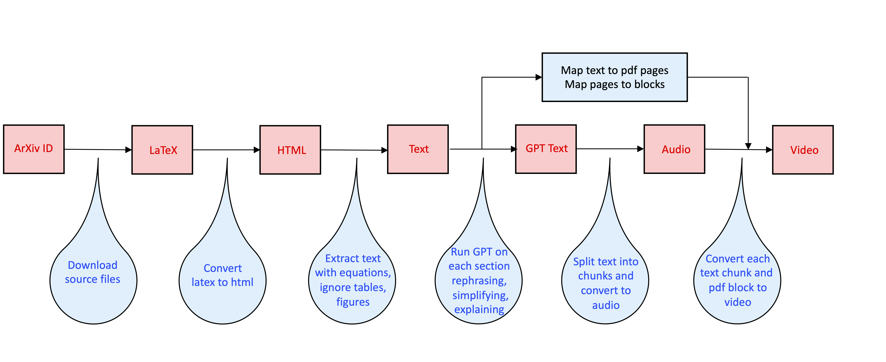

# ArXiv Paper Reader

Official implementation of the algorithm behind:
```
YouTube: https://www.youtube.com/@ArxivPapers
TikTok: https://www.tiktok.com/@arxiv_papers
Apple Podcasts: https://podcasts.apple.com/us/podcast/arxiv-papers/id1692476016
Spotify: https://podcasters.spotify.com/pod/show/arxiv-papers
```

The main idea of this work is to simplify and streamline ArXiv paper reading.
If you're a visual learner, this code will covert a paper to an engaging video format. 
If you are on the run and like listening, this code will also generate audio for listening.

## Overview



Here are the main steps of the algorithm:

1. Download paper source code, given its ArXiv ID

2. Use `latex2html` or `latexmlc` to convert latex code to HTML page

3. Parse HTML page to extract text and equations, ignoring tables, figures, etc

4. If creating video, also create a map that matches pdf page to text 
and also text chunks to page blocks.

5. Split the text into sections and pass them through OpenAI GPT api to paraphrase, simplify and explain.

6. Split GPT-generated text into chunks and convert them to audio using text-to-speach Google api

7. Pack all the necessary pieces and create a zip file for further video processing

8. Using earlier computed text-block map, create video using `ffmpeg`

**Note 1** The code can create both long, more detailed, as well as short, summarized versions of the paper.

**Note 2** The long video version will also contain summary blocks after each section

**Note 3** The short video version will contain automatically generated slides summarizing the paper

**Note 4** The code can also upload the generated audio files to your Google Drive, if provided with proper credentials

## Setup
- LaTeXML (https://github.com/brucemiller/LaTeXML)
- latex2html (https://github.com/latex2html/latex2html)
- OpenAI key
- ffmpeg (to make videos)
- gcloud: (https://cloud.google.com/sdk/docs/install)
- setup ADC: (https://cloud.google.com/docs/authentication/provide-credentials-adc#how-to)
- Google Text-to-Speech (https://cloud.google.com/text-to-speech)
- Google Drive setup (optional, follow https://github.com/iterative/PyDrive2)

## Python Packages
openai, PyPDF2, spacy, tiktoken, pyperclip, google-cloud-texttospeech, pydrive2, pdflatex

## How to run

```.bash
# to create audio, both short and long, and prepare for video creation

python main.py --verbose --include_summary --create_short --create_video --openai_key <your_key> --paperid <arxiv_paper_id> --l2h
```
The default latex conversion tool ``latex2html`` sometimes fails, in this case remove ``--l2h``
to use ``latexmlc``. Also, by default the code will process the whole paper up to references, if you want to stop earlier, pass ``--stop_word "experiments"`` (e.g., to stop before Experiments Section).

### Output 
```
<arxiv_paper_id>_files/
├── final_audio.mp3
├── final_audio_short.mp3
├── abstract.txt
├── zipfile-<time_stamp>.zip
├── ...
├── extracted_orig_text_clean.txt
├── original_text_split_pages.txt
├── original_text_split_sections.txt
├── ...
├── gpt_text.txt
├── gpt_text_short.txt
├── gpt_verb_steps.txt
├── ...
├── slides
    ├── slide1.pdf
    ├── ...
```
The output directory, among other things, contains generated audio files, slides, extracted original text 
and GPT generated output, split across pages or sections. The output also contains ``zipfile-<time_stamp>.zip``
which includes data for video generation.

```.bash
# to extract only the original text from ArXiv paper, without any GPT/audio/video processing

python main.py --verbose --extract_text_only --paperid <arxiv_paper_id>
```

Now, we are ready to generate the video:
```.bash
# to generate video based on the results from above, point to the 

python makevideo.py --paperid <arxiv_paper_id>
```

### Output 
```
output_<time_stamp>/
├── output.mp4
├── output_short.mp4
├── ...
```
The output directory now contains two video files, one for the long and another for the short video.
